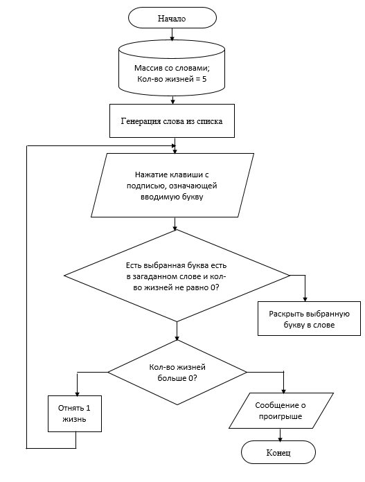
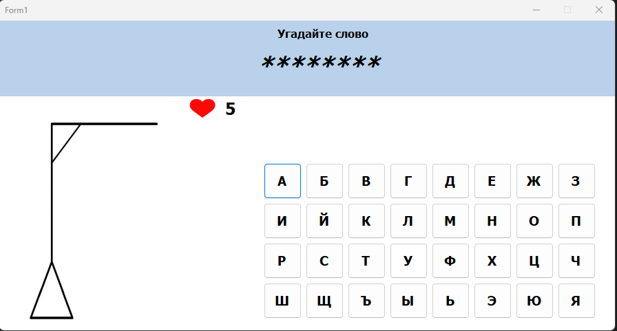
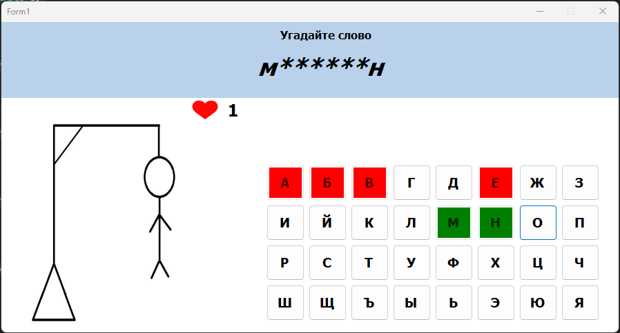
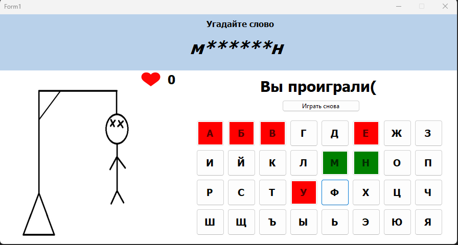
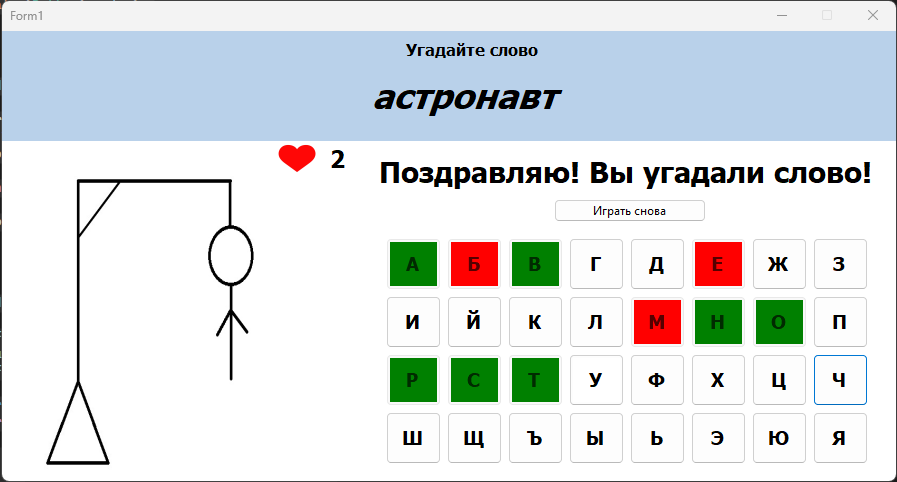

## Game Hangman

### Игра «Виселица» написана на C#

Данный проект разработан в рамках проектного практикума. Тема проектного практикума игра «Виселица». Игра реализована с помощью языка программирования C# с применение конструктора пользовательских интерфейсов Microsoft Windows Forms.

#### Проектирование интерфейса

</img>

 

#### Используемые визуальные компонент и измененные их свойства и события

- Форма (Form1) изменены свойства MaximazeBox на значение false, StartPositioon на CenterScreen. События используется Load;
- Label’s изменены свойства Name, Title, Size Font на шрифт Tahoma и размер;
- Button’s изменены свойства Name, Title, Size Font на шрифт Tahoma и размер;
- PictureBox изменено свойство Image, Size;
- Panel’s изменено свойство Size.

 

#### Алгоритм работы приложения

</img>

 

#### Скриншоты из игры

</img>
</img>
</img>
</img>
